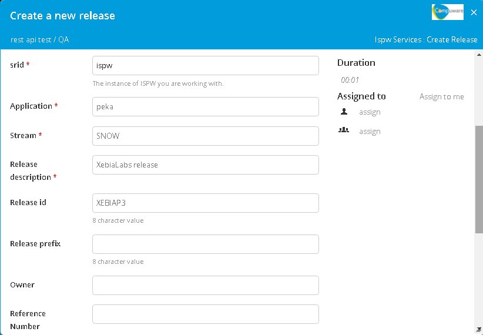
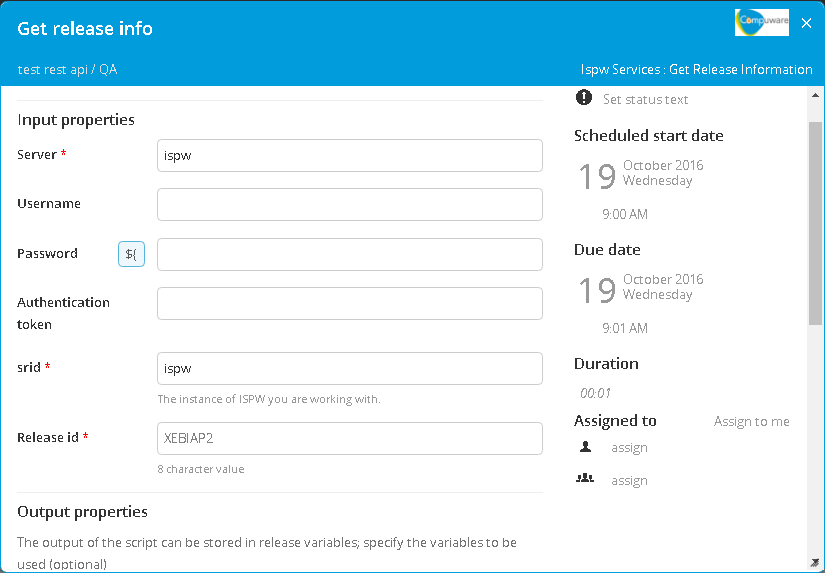
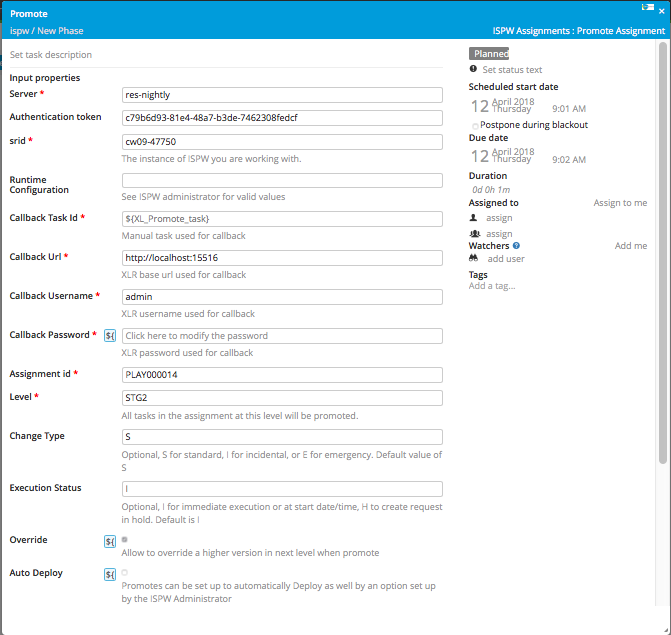
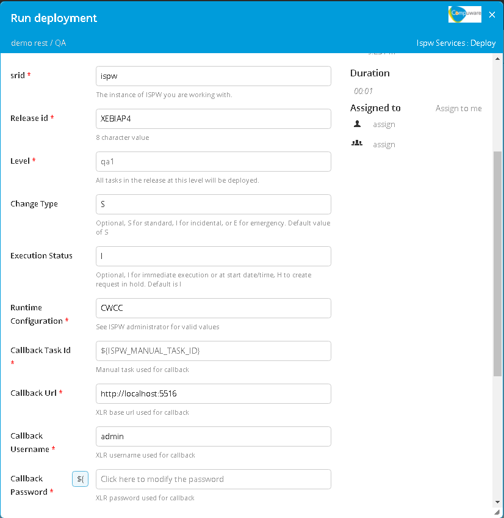
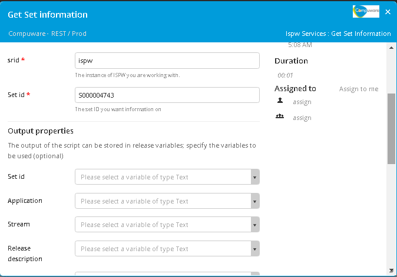
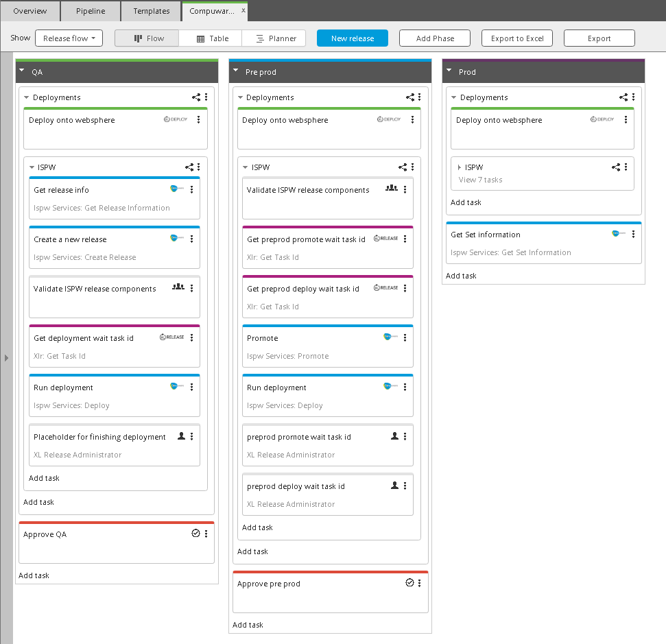

# Preface #

This document describes the functionality provided by the xlr-ispw-plugin.

See the **[XL Release Documentation](https://docs.xebialabs.com/xl-release/index.html)** for background information on XL Release and release concepts.

# CI status #

[![Build Status][xlr-ispw-plugin-travis-image]][xlr-ispw-plugin-travis-url]
[![Codacy Badge][xlr-ispw-plugin-codacy-image] ][xlr-ispw-plugin-codacy-url]
[![Code Climate][xlr-ispw-plugin-code-climate-image] ][xlr-ispw-plugin-code-climate-url]

[xlr-ispw-plugin-travis-image]: https://travis-ci.org/xebialabs-community/xlr-ispw-plugin.svg?branch=master
[xlr-ispw-plugin-travis-url]: https://travis-ci.org/xebialabs-community/xlr-ispw-plugin
[xlr-ispw-plugin-codacy-image]: https://api.codacy.com/project/badge/Grade/36153ed9460a44d289aa1186cde51fa1
[xlr-ispw-plugin-codacy-url]: https://www.codacy.com/app/joris-dewinne/xlr-ispw-plugin
[xlr-ispw-plugin-code-climate-image]: https://codeclimate.com/github/xebialabs-community/xlr-ispw-plugin/badges/gpa.svg
[xlr-ispw-plugin-code-climate-url]: https://codeclimate.com/github/xebialabs-community/xlr-ispw-plugin

# Overview #

# Installation #

* Minimal version XLR: 5.0.0+
* The `deploy` and `promote` tasks are asynch tasks. This means you'll need to provide a callback task id, that can be used to let the task fail or pass.
  In order to this you can make use of the [xlr-xlrelease-plugin](https://github.com/xebialabs-community/xlr-xlrelease-plugin) which provides a task `Get Task Id`

## Tasks ##
+ CreateRelease
  + `srid`: The instance of ISPW you are working with.
  + `Application`:
  + `Stream`:
  + `Release description`:
  + `Release id`: 8 character Release id.
  + `Release prefix`: 8 character Release prefix.
  + `Owner`:
  + `Reference Number`:
  
+ GetReleaseInformation
  + `srid`: The instance of ISPW you are working with.
  + `Release id`: 8 character Release id.
  
+ Promote
  + `srid`: The instance of ISPW you are working with.
  + `Level`: All tasks in the release at this level will be promoted.
  + `Change Type`: Optional, S for standard, I for incidental, or E for emergency. Default value of S
  + `Execution Status`: Optional, I for immediate execution or at start date/time, H to create request in hold. Default is I
  + `Release id`: 8 character Release id.
  + `Runtime Configuration`: See ISPW administrator for valid values.
  + `Callback Task Id`: Manual task used for callback
  + `Callback Url`: XLR base url used for callback
  + `Callback Username`: XLR username used for callback
  + `Callback Password`: XLR password used for callback
  
+ Deploy
  + `srid`: The instance of ISPW you are working with.
  + `Level`: All tasks in the release at this level will be deployed.
  + `Change Type`: Optional, S for standard, I for incidental, or E for emergency. Default value of S
  + `Execution Status`: Optional, I for immediate execution or at start date/time, H to create request in hold. Default is I
  + `Release id`: 8 character Release id.
  + `Runtime Configuration`: See ISPW administrator for valid values.
  + `Callback Task Id`: Manual task used for callback
  + `Callback Url`: XLR base url used for callback
  + `Callback Username`: XLR username used for callback
  + `Callback Password`: XLR password used for callback
  
+ GetSetInformation
  + `srid`: The instance of ISPW you are working with.
  + `setid`: The set ID you want information on
  
  
## Example Template ##

