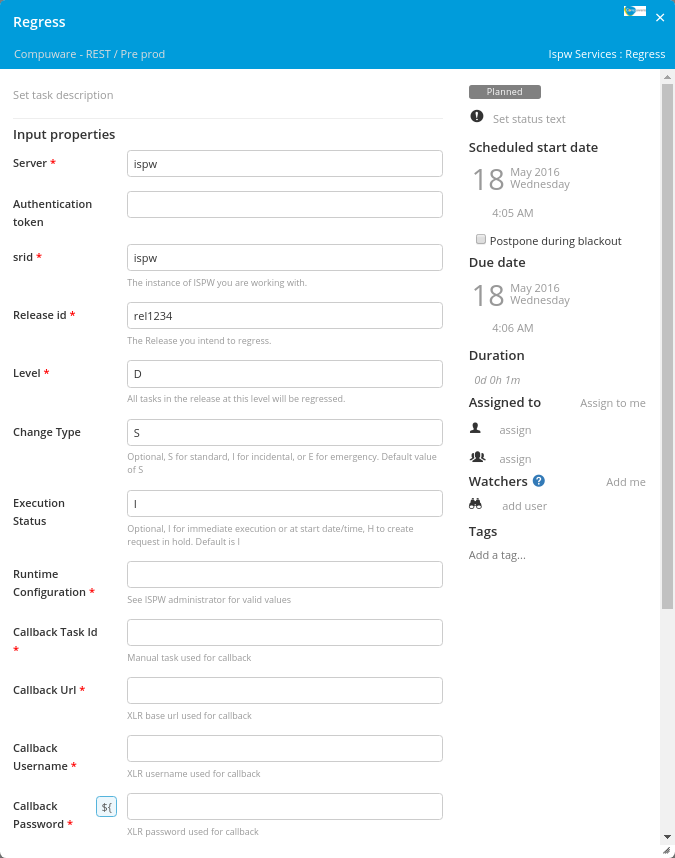
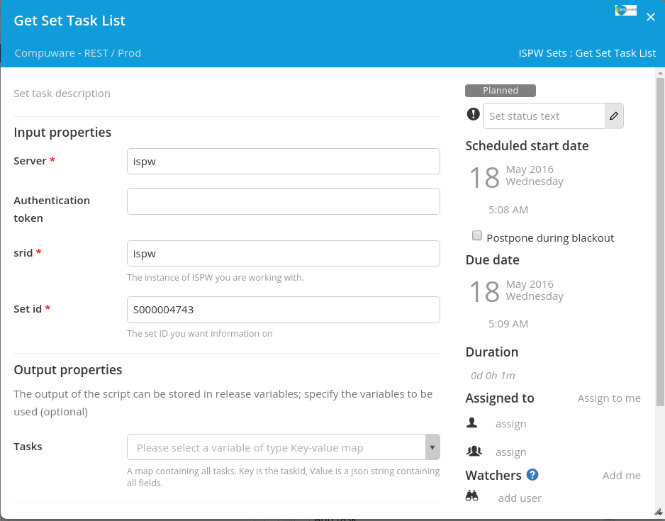
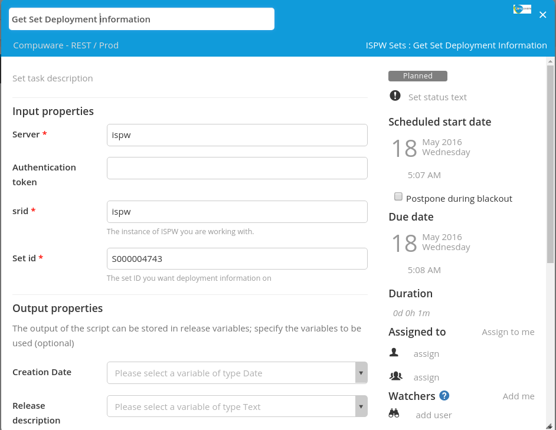
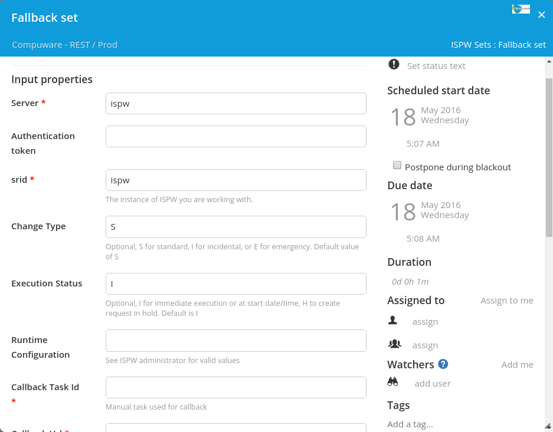

# XL Release ISPW plugin

[![Build Status][xlr-ispw-plugin-travis-image]][xlr-ispw-plugin-travis-url]
[![Codacy Badge][xlr-ispw-plugin-codacy-image] ][xlr-ispw-plugin-codacy-url]
[![Code Climate][xlr-ispw-plugin-code-climate-image] ][xlr-ispw-plugin-code-climate-url]
[![License: MIT][xlr-ispw-plugin-license-image] ][xlr-ispw-plugin-license-url]
[![Github All Releases][xlr-ispw-plugin-downloads-image] ]()

[xlr-ispw-plugin-travis-image]: https://travis-ci.org/xebialabs-community/xlr-ispw-plugin.svg?branch=master
[xlr-ispw-plugin-travis-url]: https://travis-ci.org/xebialabs-community/xlr-ispw-plugin
[xlr-ispw-plugin-codacy-image]: https://api.codacy.com/project/badge/Grade/36153ed9460a44d289aa1186cde51fa1
[xlr-ispw-plugin-codacy-url]: https://www.codacy.com/app/joris-dewinne/xlr-ispw-plugin
[xlr-ispw-plugin-code-climate-image]: https://codeclimate.com/github/xebialabs-community/xlr-ispw-plugin/badges/gpa.svg
[xlr-ispw-plugin-code-climate-url]: https://codeclimate.com/github/xebialabs-community/xlr-ispw-plugin
[xlr-ispw-plugin-license-image]: https://img.shields.io/badge/License-MIT-yellow.svg
[xlr-ispw-plugin-license-url]: https://opensource.org/licenses/MIT
[xlr-ispw-plugin-downloads-image]: https://img.shields.io/github/downloads/xebialabs-community/xlr-ispw-plugin/total.svg

## Preface

This document describes the functionality provided by the xlr-ispw-plugin.

See the **[XL Release Documentation](https://docs.xebialabs.com/xl-release/index.html)** for background information on XL Release and release concepts.

## Overview

This is a plugin allowing to interact from XL Release with ISPW for deploying, promoting, ... applications on the mainframe.

## Installation

* Minimal version XLR: 7.1.0+
* The `deploy` and `promote` tasks are asynch tasks. This means you'll need to provide a callback task id, that can be used to let the task fail or pass.
  In order to this you can make use of the [xlr-xlrelease-plugin](https://github.com/xebialabs-community/xlr-xlrelease-plugin) which provides a task `Get Task Id`

## Tasks
+ CreateRelease

    
    
+ GetReleaseInformation

    
    
+ Promote

    
    
+ Regress

    
    
+ Deploy

    
    

### Sets
+ GetSetInformation

    
    
+ GetSetTaskList

    
    
+ GetSetDeploymentInformation

    
    
+ FallbackSet

    
  
## Example Template

